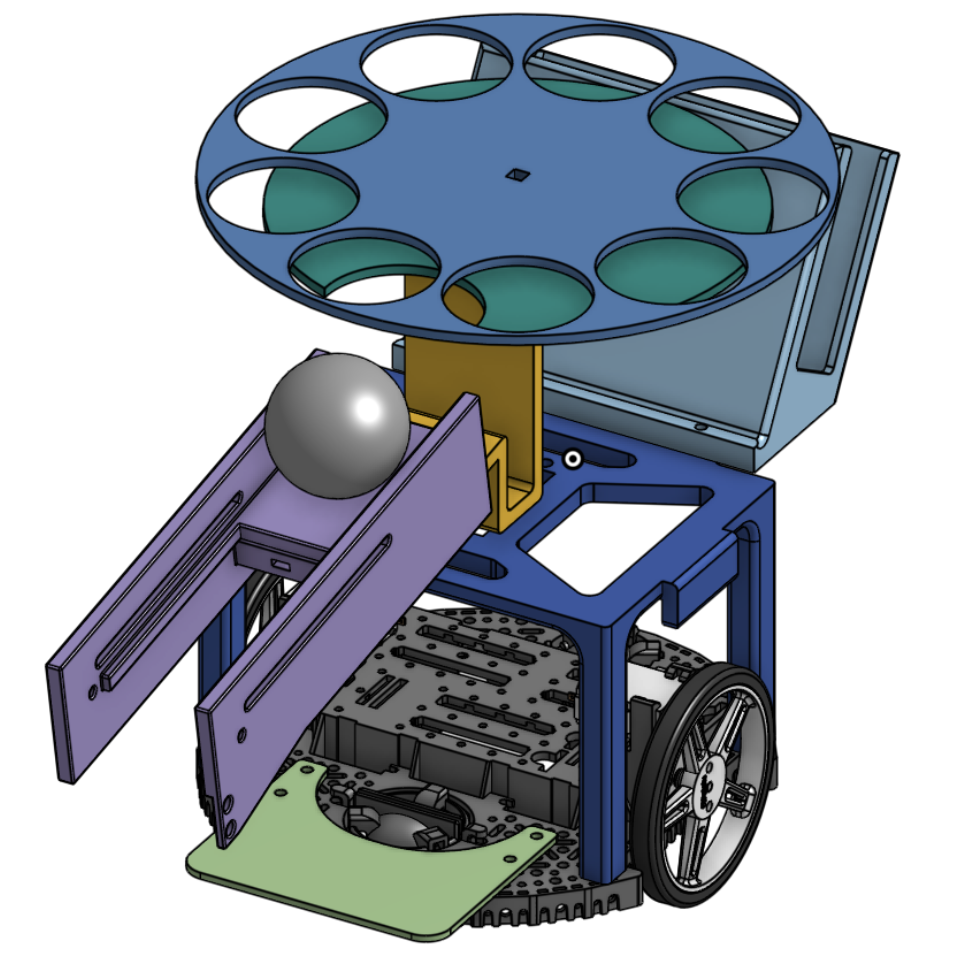

# Ball-E
Ball-E is a competition robot built around a Raspberry Pi + Pololu A-Star 32U4 control stack for autonomous navigation, targeting, and scoring. The robot can start from a random map position, navigate to a shooting zone, detect which basket to aim at from randomized IR beacon signals, and execute a shot sequence.

  
  

---

## Demo

---
## Abstract
This repository captures the full development workflow for Ball-E: embedded motor control on A-Star, high-level autonomy on Raspberry Pi, line-following with PID, ultrasonic-based positioning, IR-guided target selection, and serial packet communication between compute layers.

---
## System Architecture
Ball-E is organized into three connected layers:

1. High-level autonomy layer (`src/ball-e/US_nav.py`, `src/nav.py`):
- Runs mission logic on Raspberry Pi for scan, alignment, centerline approach, and shot-state progression.
- Sends command packets (for example `<S,...>`, `<D,...>`, `<T,...>`, `<L>`) and consumes telemetry from the microcontroller.

2. Real-time control layer (`src/ball-e/src/main.cpp`):
- Executes motor commands using AStar32U4 + encoder feedback.
- Streams telemetry (`<front,left,line,busy>`) and runs line-following control with tuned PID.

3. Targeting + actuation layer (`src/ball-e/beacon_aim.py`):
- Reads left/mid/right IR beacon states on Raspberry Pi GPIO.
- Selects servo aim preset and coordinates shot-related actuation for basket targeting.

---
## Hardware
- Compute: Raspberry Pi (high-level planning and targeting) + Pololu A-Star 32U4 (real-time motor control).
- Drive: differential-drive motors with encoder feedback.
- Navigation sensors: ultrasonic range sensors + QTR line sensor array.
- Targeting sensors: three IR receiver channels (left/mid/right basket selection).
- Scoring actuation: aiming servo and feeder/launch mechanism.

---
## Software Stack
- Python autonomy scripts (`src/ball-e/US_nav.py`, `src/nav.py`, `src/ball-e/beacon_aim.py`).
- Arduino/PlatformIO firmware (`src/ball-e/src/main.cpp`) using:
  - `AStar32U4Motors`
  - `Encoder`
  - `QTRSensors`
- GPIO + low-level I/O libraries (`RPi.GPIO`, `gpiozero`, `pigpio`).
- Robust serial packet protocol between Raspberry Pi and A-Star for command/telemetry synchronization.

---
## Key Concepts
- Randomized starting-state robustness: scan/re-seek logic to localize against known field geometry before executing route steps.
- Hybrid autonomy: Pi handles mission state and decision making while A-Star handles tight motor timing and sensor loops.
- Packetized control framework: resilient serial messaging and telemetry parsing to coordinate multiple subsystems with limited hardware ports.
- Competition-focused tuning: iterative PID and motor-bias calibration for stable line following and smoother straight/turn behavior.

---
## Challenges
- Hardware reliability under competition conditions: inconsistent motors and electrical noise required repeated re-tuning and fallback handling.
- Sensor noise and dropouts: ultrasonic and line data needed filtering/tolerance logic to avoid unstable behavior.
- Line-following + motor PID instability: significant calibration was required to reduce oscillation and improve trajectory smoothness.
- Port constraints on embedded hardware: solved by consolidating subsystem control through a structured Python-to-Arduino serial framework.

---
## Future Work
This project is finalized for the current competition season, but potential future improvements include:
- Add explicit sensor-fusion/state-estimation instead of mostly timed transitions during some phases.
- Replace blocking motion primitives with fully non-blocking task scheduling and fault recovery.
- Improve targeting confidence with beacon debouncing/windowed voting and richer shot diagnostics.
- Add simulation + replay tooling for faster pre-competition testing.

---
## Additional Documentation
- Main firmware: [src/ball-e/src/main.cpp](src/ball-e/src/main.cpp)
- Mission control script: [src/ball-e/US_nav.py](src/ball-e/US_nav.py)

